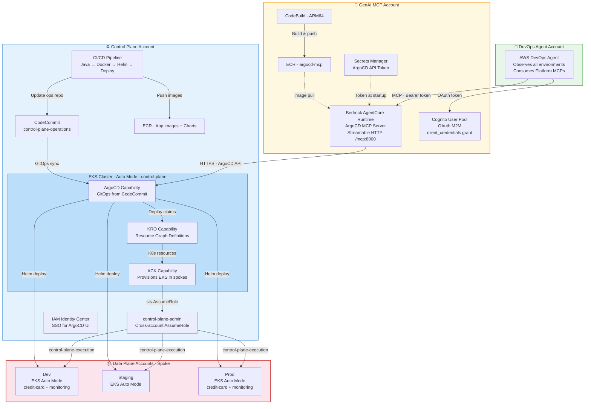
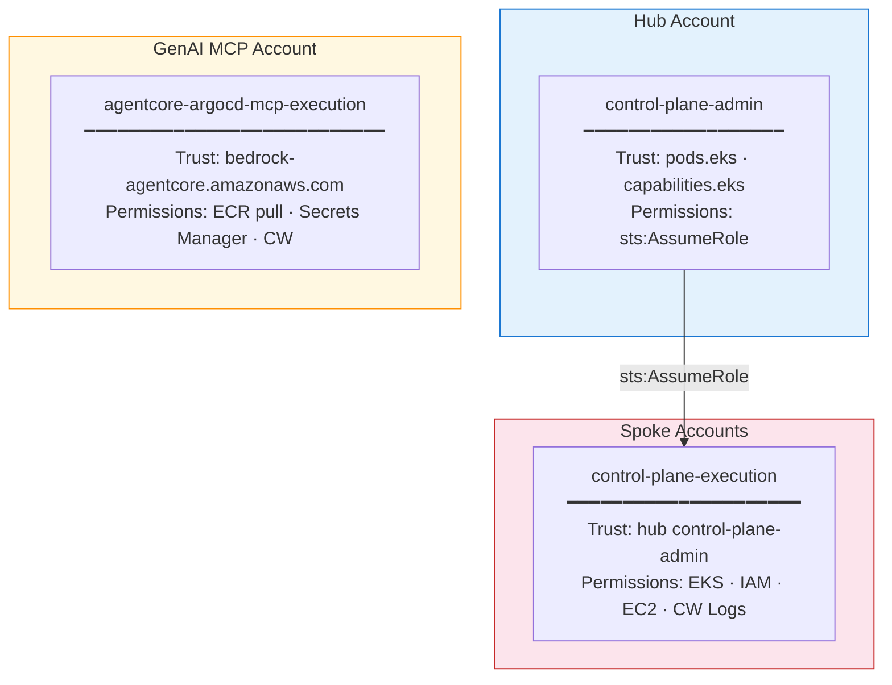

# Architecture Overview

> **Deployment Modes:**
> - **Multi-account (production):** Separate AWS accounts for Hub, GenAI MCP, and Spoke(s) as shown in the architecture diagram.
> - **Single-account (workshop/dev):** All components in one account. Set `enable_ecr_replication = false` in bootstrap, and use the same account ID for `spoke_account_id`.

## IAM Model

