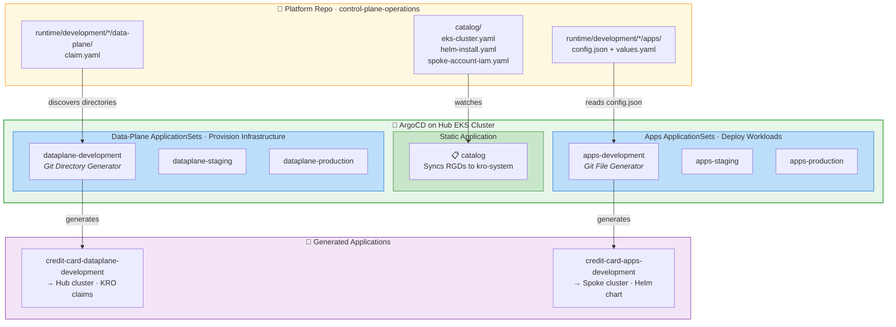
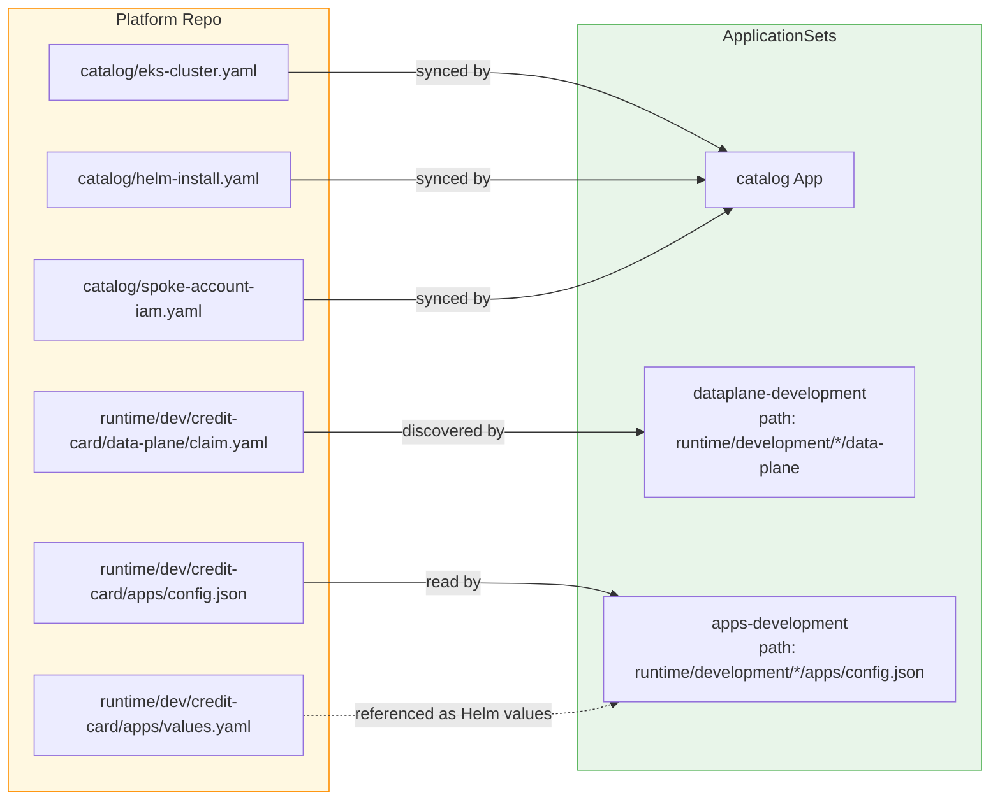
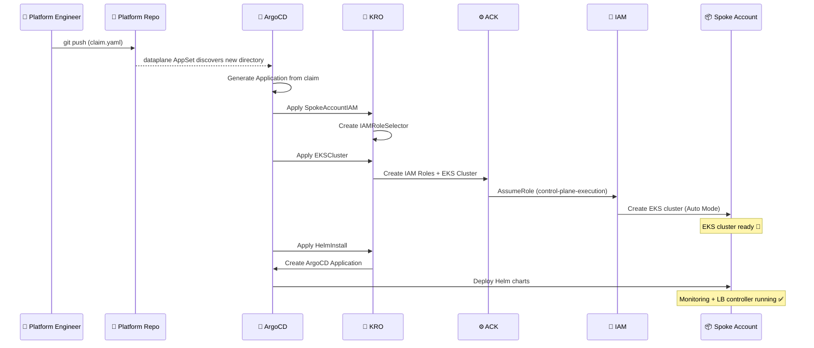

# ArgoCD ApplicationSets

ArgoCD uses six ApplicationSets (two per environment) plus one static Application:

## Data-Plane vs Apps ApplicationSets

| | Data-Plane AppSet | Apps AppSet |
|---|---|---|
| Generator | Git Directory | Git File (config.json) |
| Watches | `runtime/{env}/*/data-plane/` | `runtime/{env}/*/apps/config.json` |
| Deploys to | Hub cluster (control-plane) | Spoke clusters (by name) |
| Content | KRO claims (SpokeAccountIAM, EKSCluster, HelmInstall) | OCI Helm charts from ECR + values.yaml from Git |
| Purpose | Provision infrastructure | Deploy application workloads |
| Processed by | KRO → ACK → AWS APIs | ArgoCD → Helm → K8s API |

## ApplicationSet Discovery Patterns

## Platform Claim Processing

How infrastructure gets provisioned when a platform engineer pushes a new claim:

