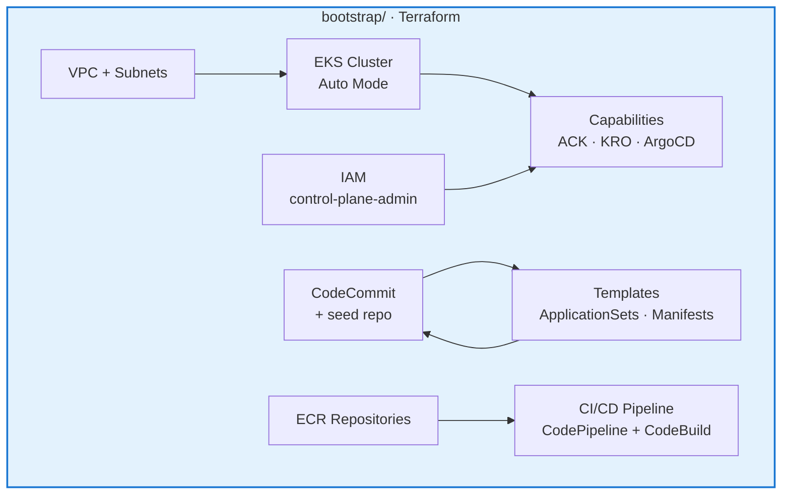
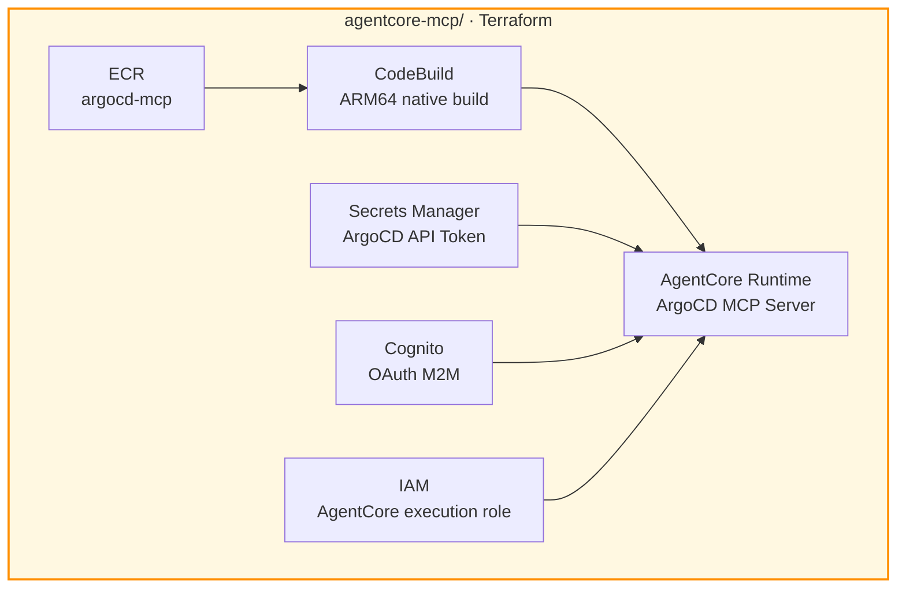

# Modules

## bootstrap/ — Control Plane (Hub Account)



Dependencies: `terraform-aws-modules/eks/aws` (~> 21.15), `terraform-aws-modules/vpc/aws` (~> 6.0)

## agentcore-mcp/ — GenAI MCP Platform



Inputs: `argocd_server_url` (from bootstrap outputs), `argocd_api_token` (manual)

## catalog/ — Platform APIs (KRO RGDs)

| RGD | Kind | Purpose |
|-----|------|---------|
| eks-cluster.yaml | EKSCluster | Provisions EKS Auto Mode cluster in spoke account with IAM roles, addons, ArgoCD registration |
| helm-install.yaml | HelmInstall | Creates ArgoCD Application for Helm chart deployment to spoke clusters |
| spoke-account-iam.yaml | SpokeAccountIAM | Maps K8s namespace to spoke account execution role via IAMRoleSelector |

## runtime/ — Environment Claims

```
runtime/<environment>/<runtime-name>/
├── data-plane/claim.yaml    # SpokeAccountIAM + EKSCluster + HelmInstall
└── apps/                    # Application configs for ApplicationSets
    ├── config.json          # { chartUrl, chartName, chartVersion, clusterName, namespace }
    └── values.yaml          # Helm values overrides
```
