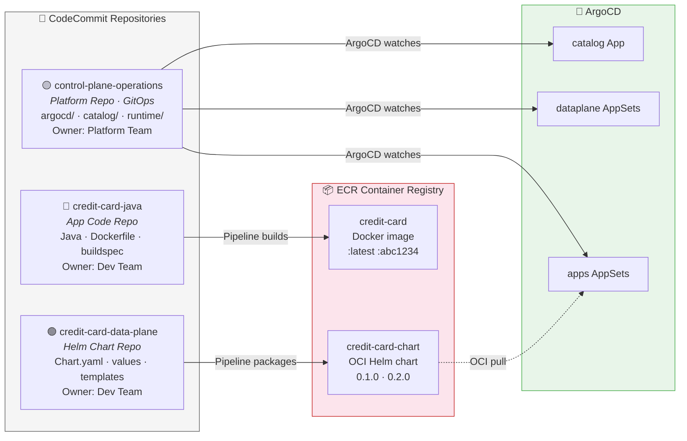
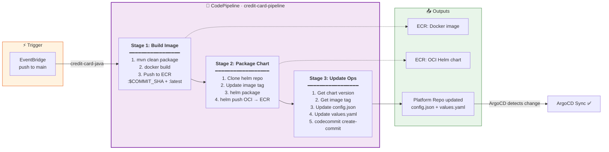
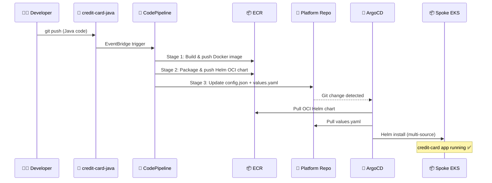

# Repository Ecosystem & CI/CD Pipeline

## Repository Ecosystem

Three repository types work together through the CI/CD pipeline and ArgoCD:



| Repository | Type | Content | Consumed By |
|---|---|---|---|
| credit-card-java | App Code | Java source, Dockerfile, buildspec | CodePipeline Stage 1 |
| credit-card-data-plane | Helm Chart | Chart.yaml, values.yaml, templates/ | CodePipeline Stage 2 |
| control-plane-operations | Platform (GitOps) | argocd/, catalog/, runtime/, applications/ | ArgoCD (all ApplicationSets) |

## CI/CD Pipeline — Detailed Flow



### What Stage 3 writes to the Platform Repo

```
control-plane-operations/
├── runtime/development/credit-card/apps/
│   ├── config.json          ◄── { chartUrl, chartName, chartVersion }
│   └── values.yaml          ◄── { image.repository, image.tag }
```

## End-to-End: Code Push to Running Workload


